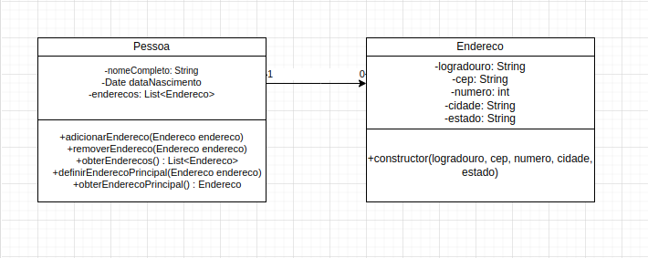
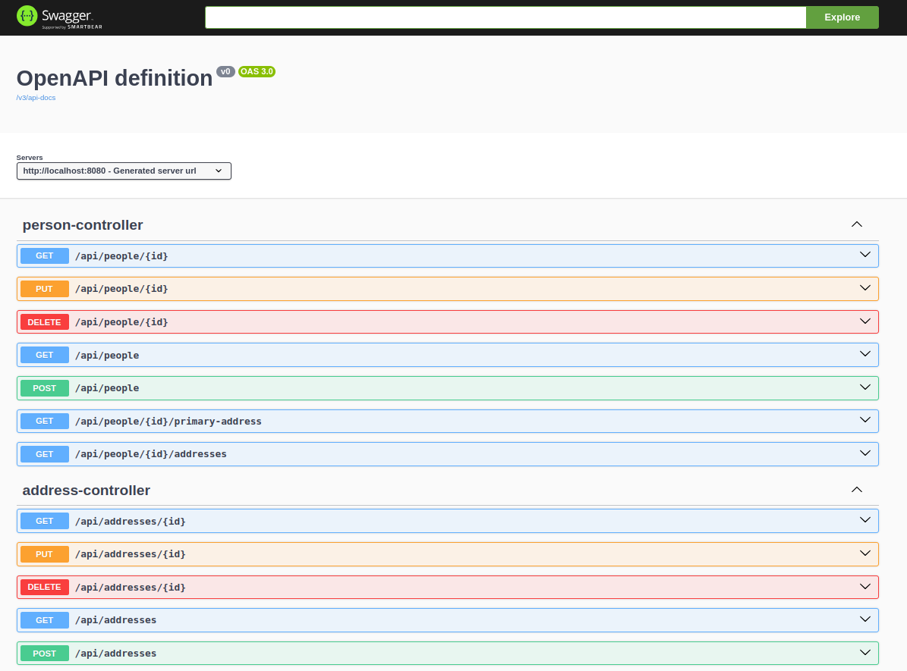
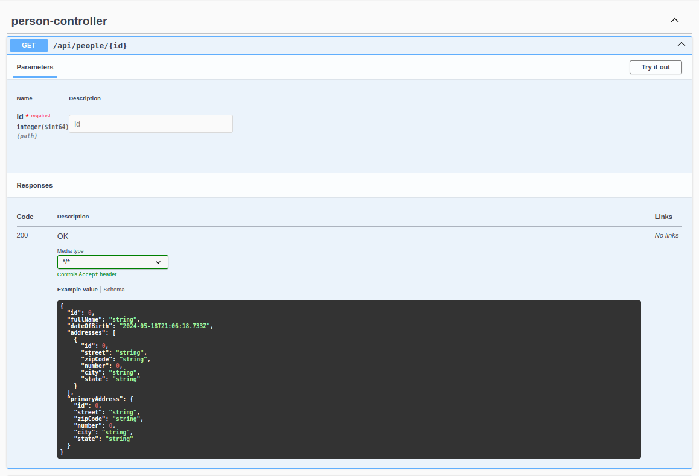

# Gerenciamento de Pessoas API

A Gerenciamento de Pessoas API é uma aplicação RESTful desenvolvida para permitir a criação, edição e consulta de pessoas e seus endereços associados.

## Estrutura do Projeto

O projeto segue uma estrutura organizada em camadas, respeitando os conceitos de Design Patterns, SOLID e Clean Code. A estrutura básica é composta por:

- `src/main/java/com/people/management/api`: Contém o código-fonte da aplicação.
  - `controller/`: Controladores REST.
  - `model/`: Entidades da aplicação.
  - `repository/`: Interfaces de acesso a dados.
  - `service/`: Lógica de negócio da aplicação.
    - `impl/`: Implementações dos serviços.

## Diagrama de Classes



## Endpoints

A API fornece os seguintes endpoints:

- `POST /api/pessoas`: Cria uma nova pessoa.
- `PUT /api/pessoas/{id}`: Atualiza uma pessoa existente.
- `GET /api/pessoas`: Obtém a lista de todas as pessoas.
- `GET /api/pessoas/{id}`: Obtém os detalhes de uma pessoa específica.
- `DELETE /api/pessoas/{id}`: Exclui uma pessoa.
- `POST /api/pessoas/{id}/enderecos`: Adiciona um novo endereço para uma pessoa.
- `PUT /api/pessoas/{id}/enderecos/{enderecoId}`: Atualiza um endereço existente para uma pessoa.
- `GET /api/pessoas/{id}/enderecos`: Obtém a lista de todos os endereços de uma pessoa.
- `DELETE /api/pessoas/{id}/enderecos/{enderecoId}`: Exclui um endereço de uma pessoa.
- `PUT /api/pessoas/{id}/enderecos/{enderecoId}/principal`: Define um endereço como principal para uma pessoa.

## Pré-requisitos

Antes de executar o projeto, certifique-se de ter instalado:

- JDK 11 ou superior
- Apache Maven
- PostgreSQL (opcional, se desejar utilizar um banco de dados)

## Execução do Projeto

1. Clone o repositório:

   ```bash
   git clone https://github.com/alexsouza10/people-management.git 

# Navegue até o diretório do projeto:
cd gerenciamento-pessoas-api

# Execute o comando Maven para construir o projeto:
mvn clean install

# Execute o aplicativo Spring Boot:
mvn spring-boot:run

O aplicativo estará acessível em [http://localhost:8080](http://localhost:8080).

## Testes
O projeto inclui testes automatizados para garantir a qualidade do código. Execute os testes usando o comando:

```bash
mvn test
```

# Documentação com Swagger


Aproveite a praticidade e a eficiência do Swagger para explorar e testar a API de Gerenciamento de Pessoas! Com o Swagger, você pode visualizar de forma interativa todos os endpoints disponíveis, bem como os detalhes de cada requisição. Não perca tempo! Rode a aplicação e acesse a URL do Swagger em http://localhost:8080/swagger-ui/index.html para começar a explorar agora mesmo. Experimente e descubra como é fácil e intuitivo utilizar nossa API com o Swagger!

<div style="display: flex; justify-content: center;">
  
  
</div>
